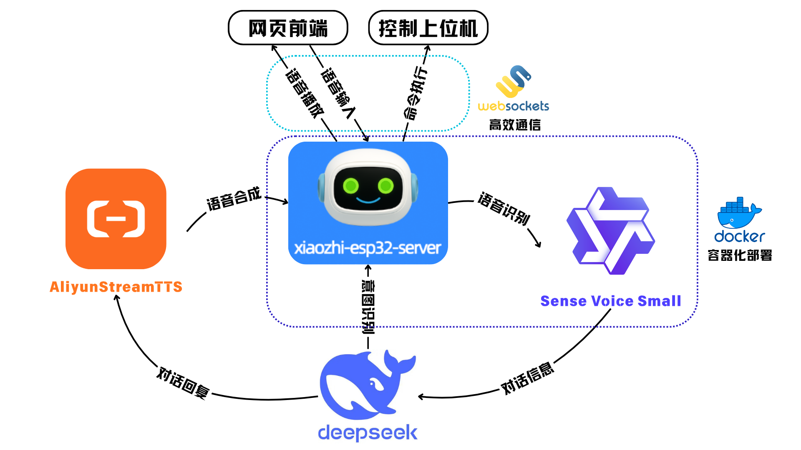

# Zhi Grip

[中文版][Readme.md]

Voice-controlled 3-DOF visual robotic arm

## Demo Video

[](https://www.youtube.com/embed/Yv7Xh_hzRgY)

## Directory Structure

- `3DParts`: 3D models
- `Controller`: Python PC-side program, responsible for vision processing and control
- `Control`: ESP32 Arduino embedded code, handles hardware driving and end-effector position maintenance
- `xiaozhi-server`: Voice interaction server based on [xiaozhi-esp32-server](https://github.com/xinnan-tech/xiaozhi-esp32-server)
- `Joystick`: Joystick control scripts

## Project Architecture





## Notes

This project uses **Git submodules** to manage each component repository. Submodules allow embedding other Git repositories into specific directories of this repository, keeping modules independent while making unified management easier.

### Cloning the Project

To properly clone a repository with submodules, use:

```
git clone --recurse-submodules https://github.com/LanternCX/ZhiGrip.git
```

If you’ve already cloned the repository but haven’t initialized the submodules, run:

```
git submodule update --init --recursive
```

------

### Updating Submodules

When the remote submodule repository has updates, you can run:

```
git submodule update --remote
```

If you develop and commit changes inside a submodule, you can also record the latest submodule commit in the main repository:

```
git add <submodule_directory>
git commit -m "Update submodule"
```