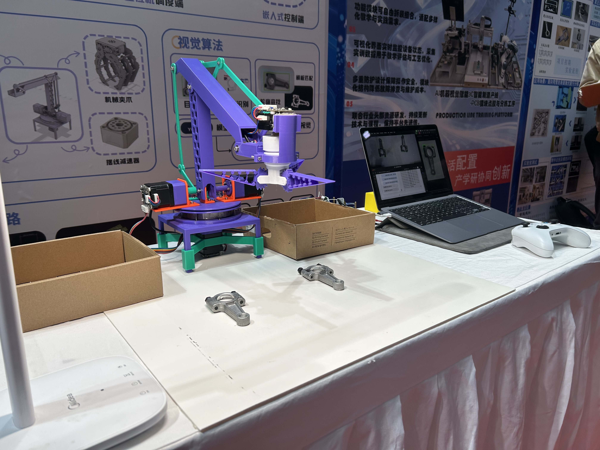

# Zhi Grip

**Zhi Grip: Voice-Controlled Visual Grasping Robotic Arm**

---

## Language / 文档语言

[English](./Readme_EN.md) / [中文](./Readme.md)

---

## Project Overview

### Directory Structure

```bash
.
├── 3DParts            # 3D model files
├── Control            # Arduino embedded control module
├── Controller         # PC control module
├── Joystick           # Joystick control module
├── xiaozhi-server     # Voice interaction server (XiaoZhi)
├── docs               # Documentation resources
├── LICENSE            # Open-source license (GPL3.0)
└── Readme_EN.md       # English documentation
```

### Project Architecture

The overall architecture is shown below:


### Demo Video

Click the image below to watch the demo video:

[](https://www.bilibili.com/video/BV1MnWhzCEoF/)

------

## Quick Start

### Clone the Project

This project uses Git submodules. It is recommended to clone as follows:

```bash
# Clone the main repository along with all submodules at once
git clone --recursive https://github.com/LanternCX/ZhiGrip.git
```

If you have already cloned the repo but submodules are not initialized or updated, run:

```bash
git submodule update --init --recursive
```

### Update All Git Submodules

When submodules have updates, you can sync all submodules in the main project:

```bash
# Pull latest updates of main repository
git pull origin main

# Update all submodules to the latest version
git submodule update --recursive --remote
```

This ensures that all submodules referenced by the main project are up to date.

## License & Contribution

### Using This Code

Please comply with the **GNU General Public License v3.0 (GPL-3.0)** when using this project's code.

If you use or modify the code, you must follow the terms of GPL-3.0 and distribute your work under the same license.

If you use this code or have any questions or collaboration ideas, feel free to contact me via email: `caoxin@xysu.tech`

### Contributing

If you want to contribute to a submodule, follow these steps:

1. **Fork** the corresponding submodule repository on GitHub, e.g., `Control` or `xiaozhi-server`.
2. Clone your forked submodule locally:

```bash
git clone https://github.com/<your-username>/<submodule-repo>.git
cd <submodule-repo>
```

3. Create a new branch for your feature:

```bash
git checkout -b feature/your-feature-name
```

4. Commit your changes:

```bash
git commit -m "feat: Describe your changes, following Angular Git commit convention"
```

5. Push your branch to your fork:

```bash
git push origin feature/your-feature-name
```

6. Create a **Pull Request (PR)** on the submodule repository (PR is for the submodule, not the main repo).