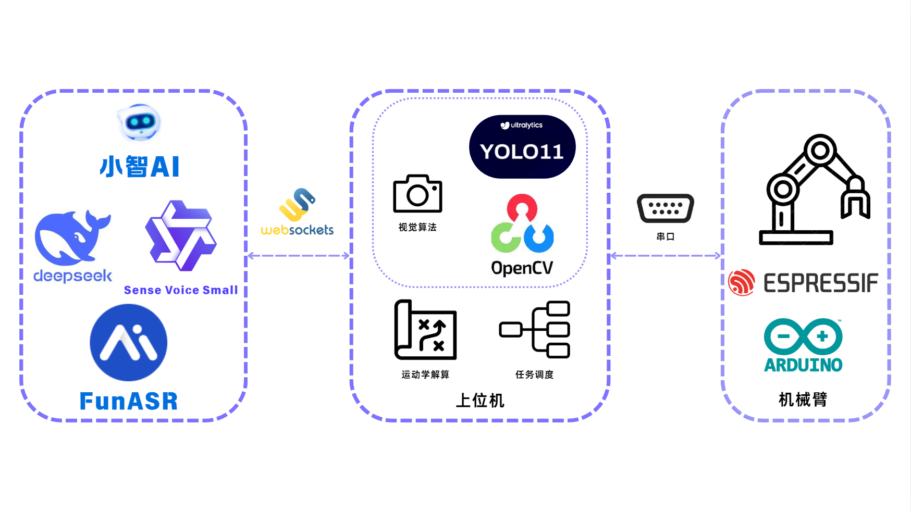
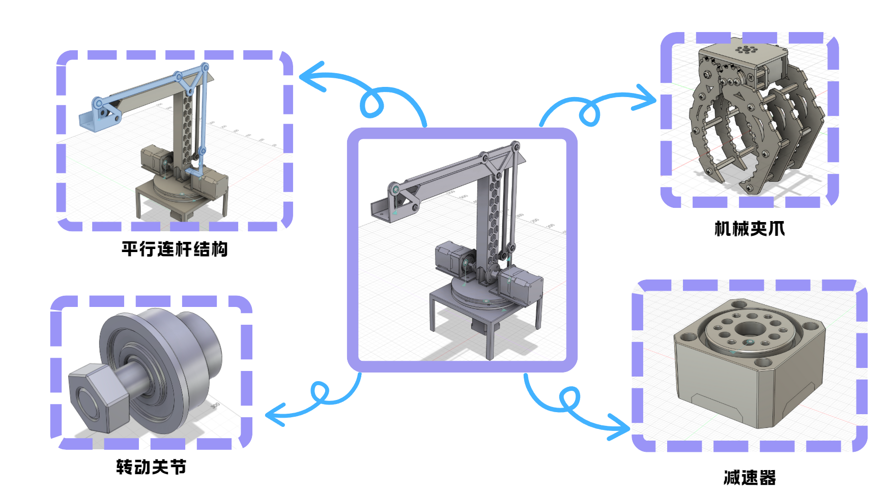
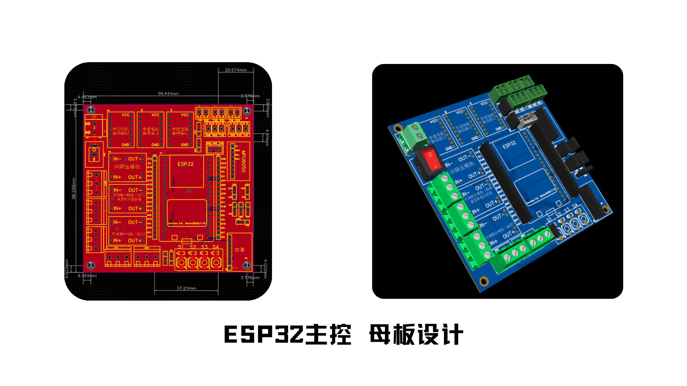
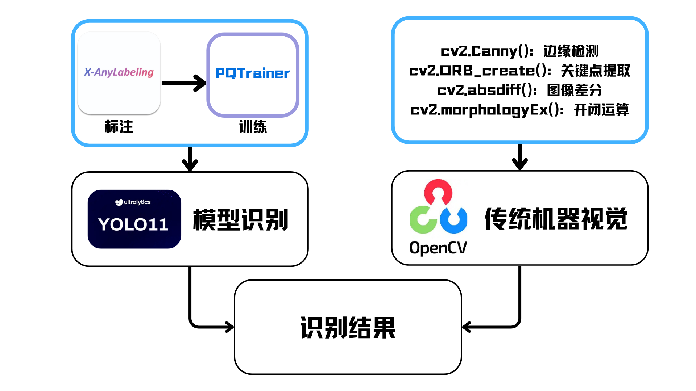
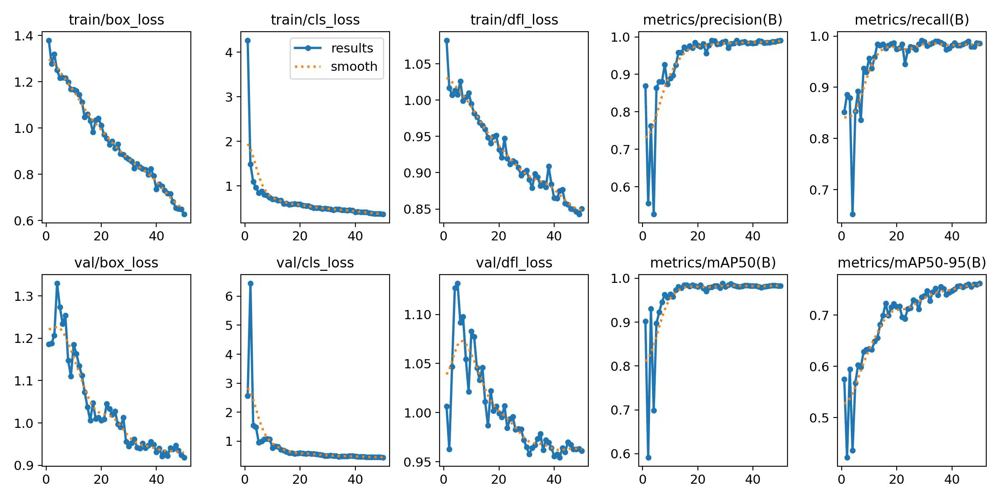
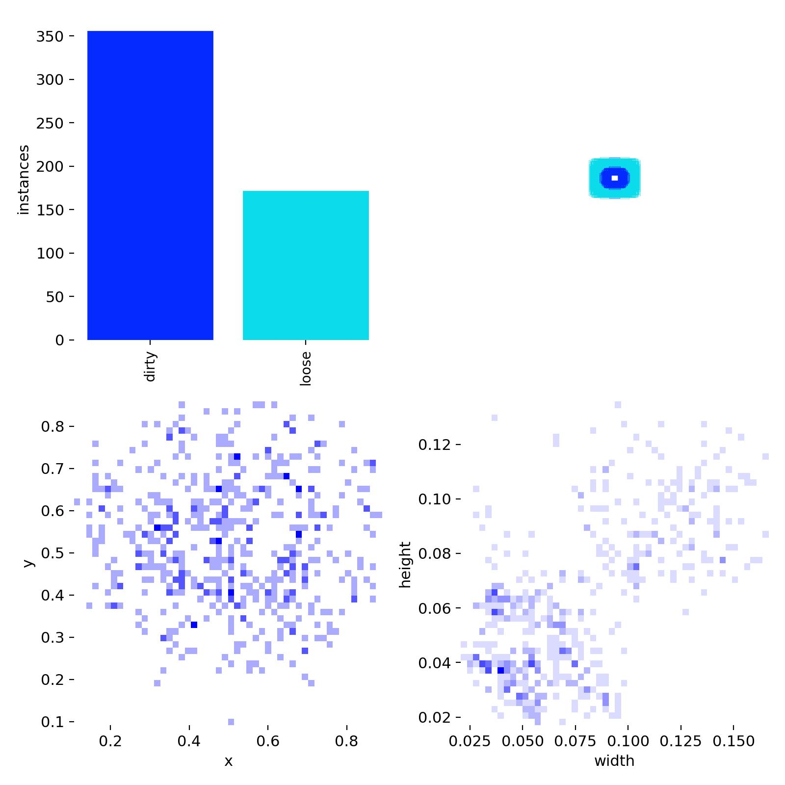
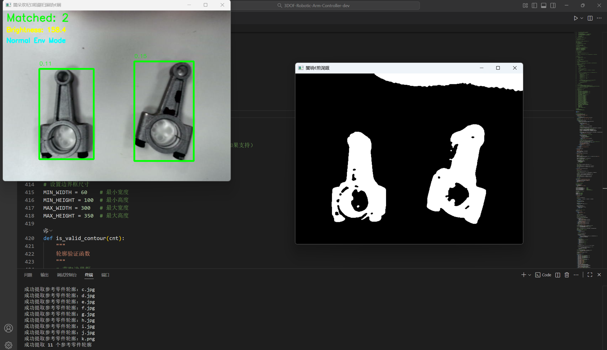
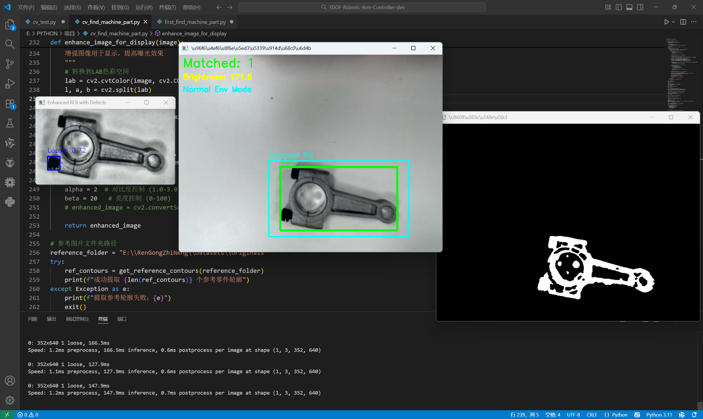
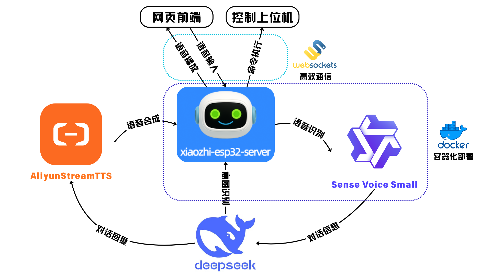
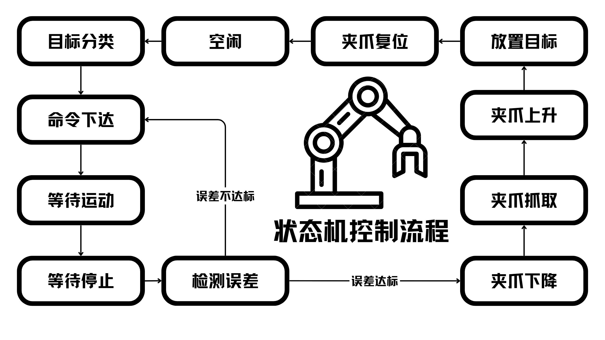

# 知握：语音驱动的视觉抓取智能机械臂

## 一、项目背景与赛题分析

## 1.1 制造业痛点与智能化需求

当前制造业正处于由自动化向**智能化转型**的关键阶段。传统生产线普遍面临工艺更新周期长、柔性化不足、人机交互智能化水平低等问题，尤其在零件检测与分拣环节中，仍依赖人工识别和操作，效率低且误差率高。
 在此背景下，如何利用人工智能技术实现“**感知—决策—执行一体化**”，成为智能制造领域的重要方向。通过引入机器视觉、语音交互、大模型算法等多模态智能技术，可以显著提升生产线的自动化与智能协同能力，减少人工干预，改善制造效率和稳定性。

## 1.2 赛题目标与核心技术挑战

本赛题以“**智能检测及无序分拣**”为主题，旨在推动人工智能技术在**工业场景**中的应用落地。参赛团队需通过多模态大模型与工业设备的结合，完成零件检测、缺陷识别、语音控制分拣等任务，构建一个具备感知、理解与执行能力的智能分拣系统。

该任务的核心技术挑战包括：**视觉识别精度与鲁棒性**、**语音指令的理解与执行**、**机械臂控制与运动规划**等。同时，对项目团队成员的**技术硬实力**与**团队合作能力**也是一大考验。

## 1.3 项目技术切入点与建设目标

本项目依托**校实验室平台资源**开展。实验室长期开展无人机、机器人类项目实践，团队成员参与电子设计竞赛、智能汽车竞赛与 Robocon 等学科竞赛，积累了丰富的机械结构设计、嵌入式控制与计算机视觉经验。看到本赛题后，团队认为该课题作为切实的行业痛点，不仅具有较高的**技术挑战性**，更处于**人工智能赋能制造业的关键交叉点**，兼具产业应用价值与科研创新意义。

项目以**企业实际需求为导向**，结合实验室已有的硬件条件与技术积累，构建**低成本、高扩展性**的智能分拣平台。系统以“**语音控制 + 视觉识别 + 机械臂执行**”为核心架构，形成“听、看、动”协同的多模态智能控制体系。

------

## 二、系统总体架构与应用场景设计

### 2.1 系统总体架构与工作原理



### 2.2 模块功能划分与协同机制

系统整体架构遵循“**语音理解—任务决策—运动执行**”的多层级协同逻辑，主要由三部分组成：语音交互模块（小智AI）、上位机控制模块以及下位机执行模块。三者之间通过**标准化通信接口**实现数据交互与任务协作，形成稳定高效的多模态控制体系。

#### 语音交互模块

该模块负责**语音识别、自然语言解析**以及任务意图生成。通过调用本地语音识别引擎 Sense Voice Small，将语音实时转换为文字，并通过 Deepseek 开放平台的 HTTP API 借助大语言模型 **Function Calling** 机制完成语义理解与指令解析。当识别到有效操作命令后，模块会将指令封装为**结构化任务信息**，通过 WebSocket 协议发送至上位机。

#### 上位机控制模块

上位机运行于**边缘计算终端**，是整个系统的**核心调度中心**。该模块负责**视觉识别、运动学计算、任务调度**与状态机管理。上位机接收到小智的指令后，先调用视觉模块进行**目标检测与定位**，再根据目标位置计算机械臂的**运动学逆解**，并生成具体的控制参数。随后通过串口通信将执行指令下发至下位机，交由下位机执行。

#### 下位机执行模块

下位机以乐鑫科技 **ESP32** 为核心控制单元，通过串口接收上位机的运动指令并解析执行。其主要任务包括**舵机与步进电机底层控制、姿态调整及夹爪动作执行**。通过与基于串口协议的**闭环 FOC 步进电机控制器**配合，实现了机械臂电机控制与抓取动作。下位机实时回传执行状态，上位机根据反馈结果判断任务完成情况，从而形成**稳定可靠的通信与控制闭环**。

整个系统的通信机制采用**分层解耦设计**：语音模块与上位机通过 **WebSocket** 保持低延迟网络连接，实现任务级语义传递；上位机与下位机通过**串口通信**完成实时控制指令下发与状态反馈，从而实现**语音、视觉与控制的多模态融合协同**。

### 2.3 工业分拣应用场景与流程描述

在智能制造中，视觉分拣机械臂可实现物料的自动识别与搬运，提升生产线柔性与效率。系统工作流程为：高清摄像头采集工作台图像，小智识别并指令上位机执行抓取任务；上位机进行 坐标转换与路径规划 后，通过串口下发指令至下位机；下位机控制 机械臂和夹爪执行抓取、搬运、投放动作，完成一次分拣循环。整个过程 语音可控、视觉自适应，减少人工干预，实现 高效智能的分拣自动化。

------

## 三、机械与电子系统设计

### 3.1 机械结构设计与制造方案

本项目的机械臂采用 **RRR 构型三自由度结构**，包含旋转、肩、肘三关节，整体呈串联形式。机械部分由团队成员通过 **Fusion360 软件自主建模**完成，结构件采用PETG材料**3D打印制造**。



为保证**末端执行器的姿态稳定性**，机械臂在末端至旋转平台增加了一组**平行连杆机构**，使末端平台在运动过程中保持水平。关键受力连杆关节处嵌入关节法兰轴承和轴肩螺栓加强固定，并降低关节旋转过程中的阻尼。减速系统采用**1:20摆线减速器**，在保持速度响应的同时提供足够扭矩并降低回差。

末端执行器采用**模块化接口设计**，可快速更换为舵机夹爪或吸盘抓具，兼容不同类型的零件抓取任务，并预留安装力或视觉传感器的扩展位置。机械结构在装配完成后进行零位标定和限位校验，以保证运动精度与安全性。

### 3.2 电子系统的设计方案



电子系统由**ESP32控制核心**及其拓展母板和闭环步进电机控制器组成。

主控部分使用自研母板搭载**ESP32-S3最小系统开发板**，集成电源管理、电机通信接口、CAN收发器和调试串口。主控负责任务调度、指令解析、通信管理以及下位控制器的协调控制。主控系统使用**12V 3S锂电池**供电，通过高效降压模块为 ESP32 及外围电路提供 5V/3.3V 稳定电压，并加入过流、欠压保护电路。

电机控制部分采用**卡元闭环步进电机控制器**，内部以 STM32 为核心，基于磁编码器与 FOC 算法实现电流环、速度环、位置环的全闭环控制，支持位置模式和速度模式。电机控制器与主控板通过 CAN 总线通信，实现高实时性和高可靠性的分布式控制结构。

系统整体具备**急停、堵转、欠压保护与断电复位机制**。电路板采用多层 PCB 设计，关键信号线路使用隔离与滤波措施，有效降低电磁干扰。通过模块化连接方式，便于电机、传感器及外围设备的快速接入与维护。

---

## 四、视觉检测与模型训练

### 4.1 视觉算法总体框架



### 4.2 数据采集与预处理

首先通过**工业相机**采集多角度、多光照条件下的工件图像，构建大规模原始数据集。为高效处理数据，从数据集中提取一小部分样本，使用 **LabelImg 工具**手动标注工件的缺陷特征，如表面污渍与螺丝松紧状态，生成高质量的初始标注数据。随后，基于这部分标注数据在 **YOLO8 模型**下进行训练，优化识别精度与鲁棒性；训练成功后导出 **ONNX 格式**的模型文件，并配置对应的 **yaml 训练集配置文件**，形成可用于大规模数据自动标注的轻量级检测模型。

将该模型加载至 **X-AnyLabeling 平台**，对剩余的大规模数据集进行自动标注，显著降低人工标注的时间成本。为进一步提升标注质量，采用 **Segment Anything 2.1 (Large) 模型**对自动生成的标签进行校验与纠错，通过精细化调整边界框与分割掩码，有效提高标注准确性，为后续模型训练提供高质量的数据基础。

### 4.3 模型训练与评估

#### 4.3.1 **轮廓匹配质检**模型

在 PyCharm 集成开发环境中，基于 GPU 加速计算资源，利用`yolo11s.pt`预训练模型开展视觉目标检测任务的模型训练。

数据集按 **YOLO 格式**组织，划分为 `train` 与 `val` 两个子集，每个子集分别包含 `images`与 `labels`子文件夹。每个 `.txt` 标注文件对应图像中所有检测目标，每行格式为 `class_id x_center y_center width height`，均为归一化坐标，范围 [0,1]，基于图像宽高缩放。

加载`yolo11s.pt`。在 PyCharm 的 Python 脚本中训练，训练时指定 GPU 设备及相关超参数，如**学习率、批大小、迭代轮数等**，启用混合精度训练与数据增强策略以提升模型泛化能力。

训练过程中，PyCharm 控制台实时打印每轮的训练日志，包括：

- **损失函数**：`box_loss`、`cls_loss`、`dfl_loss` ；

- **验证指标**：`mAP@0.5`、`mAP@0.5:0.95`。

#### 4.3.2 工件缺陷检测模型

将标注后的数据集按 **7:3** 比例划分为训练集与验证集，在 **PQTrainer** 平台上使用 `YOLO11s` 模型进行训练。训练过程通过多轮迭代优化损失函数，监控精度（mAP）与召回率指标，确保模型在识别细小污渍、螺丝缺陷等方面达到较高检测率。从 mAP50 最终接近 1，表明在 IoU 阈值为 0.5 时，模型对目标的检测平均准确率很高，在较宽松的匹配标准下，检测效果出色。mAP50-95 也有明显上升并趋于平稳，说明模型在 IoU 阈值从 0.5 到 0.95 范围内的整体检测精度也达到了不错的水平，具备一定的泛化检测能力。损失函数方面，box_loss、cls_loss、dfl_loss 都呈现出逐渐下降并趋于稳定的趋势，反映出模型在训练过程中，边界框回归、类别分类等方面的误差不断减小，模型逐渐收敛。


### 4.4 模型性能评估

在完成数据标注后，将标注后的数据集按 **7:3 的比例**划分为训练集与验证集，使用 **PQTrainer 训练平台**加载 `YOLO11s` 模型进行端到端的监督学习。训练过程通过多轮迭代，以随机梯度下降策略优化复合损失函数，并同步监测**平均精度（mAP）** 与**召回率（Recall）** 等核心指标，确保模型在细小污渍识别、螺丝松动检测等典型缺陷任务中具备较高的识别率与鲁棒性。

训练结果显示，**mAP50** 指标最终接近 **1.0**，表明在 IoU 阈值为 0.5 的较宽松匹配标准下，模型对目标的检测平均精度极高，具备出色的定位与识别能力。同时，**mAP50-95** 在训练过程中也呈现显著上升并最终趋于平稳，反映模型在更为严格的 IoU 阈值范围（0.5 至 0.95）内仍能保持良好性能，说明其具备较强的**跨尺度检测能力**与**泛化性能**，可适应不同难度与复杂度的工业场景。

在损失函数方面，**box_loss**（边界框回归损失）、**cls_loss**（分类损失）与**dfl_loss**（分布焦点损失）均呈现持续下降并最终收敛至稳定区间的趋势。这一现象表明，模型在训练过程中不断优化对目标位置、类别判别及边界分布的建模能力，误差逐步减小，模型整体达到有效收敛状态，为后续工业场景中的高精度、高稳定性检测任务奠定可靠基础。





### 4.5 传统视觉检测模块

为提升检测模型的稳定性与泛化能力，系统引入传统视觉算法与AI模型进行**双重定位与缺陷辅助检测**。检测流程基于OpenCV库实现，首先对输入图像进行**尺寸过滤**，排除不符合条件的干扰区域。随后对有效区域执行**灰度化处理**与**Otsu自适应阈值分割**，结合**闭运算与开运算**等形态学操作，消除噪声、连接断裂区域，完成图像预处理。

在轮廓提取阶段，系统通过**边缘检测与轮廓发现算法**提取工件外轮廓，并采用**轮廓匹配**方法，与预设参考轮廓进行相似度比对，实现工件的初步识别与定位。

为增强系统在复杂光照环境下的适应能力，算法集成**图像亮度估计模块**，实时计算图像平均亮度值。在亮环境条件下，系统自动启用**伽马校正**以降低整体亮度，并采用**CLAHE（限制对比度自适应直方图均衡化）** 增强局部对比度，有效抑制过曝与阴影干扰。随后执行形态学**开运算**进一步去除噪点，提升轮廓完整性。

最终，系统通过**轮廓验证机制**，将提取的轮廓与标准模板进行匹配，计算轮廓相似度，并在图像中绘制检测框图，完成工件的可靠识别与初步缺陷筛查。



### 4.6 联合识别机制

人工智能模型侧重于**细节检测与分类识别**，传统视觉算法则提供**结构匹配与异常对比**的几何保障。两种检测结果经融合与逻辑判断后输出最终判定结果，实现“AI 定位 + 视觉验证”的协同机制。该方案在复杂光照、背景干扰及多批次样品条件下均表现出良好的鲁棒性与稳定性。



------

## 五、多模态语音交互与智能控制



### 5.1 语音识别与语义理解机制

本系统的**语音交互**部分完全基于**小智 AI 框架**实现，形成语音输入、语义理解与动作执行的完整闭环。语音识别模块采用 **SenseVoice Small** 本地部署运行，实现实时语音转文本，无需依赖外部网络，保证低延迟与数据安全。识别得到的文字信息由小智框架直接发送至 **Deepseek API** 进行语义解析与智能应答，实现自然语言到任务指令的转换。系统支持多轮对话和上下文记忆，可通过语音完成机械臂启停、模式切换、位置控制、目标抓取等操作。

### 5.2 大模型 Function Calling 技术实现

在**语义解析**阶段，系统采用符合 **JSON Schema 2020-12** 规范的结构化 JSON 描述方式，结合 **Deepseek Function Calling API** 实现任务意图识别与指令生成。系统共配置了两个主要功能：

 （1）**Robotic-Arm-Control**：实现基于坐标或关节角度的机械臂精确控制。用户可通过自然语言指令指定机械臂空间位置或关节角度，大模型根据语义内容自动提取参数并生成标准控制指令。
 （2）**Robotic-Arm-Catch**：完成不同目标物体的抓取与分类。系统根据视觉识别结果自动匹配语音中描述的目标类别，实现语音驱动的智能分拣操作。

通过 **Function Calling** 技术，大模型在理解语义的同时能够直接调用功能接口，实现自然语言与控制指令的高效映射，显著提升语音控制的准确性与可扩展性。

### 5.3 语音-视觉-控制一体化执行闭环

语音识别、**大模型理解**与机械臂执行之间通过 **WebSocket 协议**实现实时通信。用户的语音指令经解析后，意图识别结果以结构化 **JSON 数据**格式发送至机械臂上位机，上位机根据任务类型调用运动学求解与视觉识别模块，生成抓取或移动路径指令，并下发至控制层执行。

在执行过程中，**视觉模块**实时监测目标位置与夹取状态，若发现偏差，则反馈至上位机进行二次调整，从而形成语音触发、视觉校正、动作反馈的完整控制闭环。该模式实现了语音与视觉的**多模态协同**，使机械臂能够在复杂环境中完成自主识别、定位与抓取操作。

### 5.4 工业语音交互的创新与实践

本系统在工业语音交互中的创新主要体现在“**语音—语义—控制**”链路的深度融合。与传统语音指令控制相比，本方案通过 **大模型 Function Calling 技术**实现了自然语言到结构化控制命令的直接转换，大幅提升了指令表达的灵活性与系统的智能响应能力。

通过**本地化语音识别**与边缘计算架构，系统在保证数据安全的同时降低了通信延迟，适应工业现场的实时控制需求。语音交互与视觉识别的融合使操作人员无需使用传统控制终端，即可通过口令完成复杂的分拣与检测任务，显著提高了生产线的人机协作效率与智能化水平，为多模态大模型在工业场景中的应用提供了可行的实践路径。

------

## 六、机械臂运动学解算与任务控制

### 6.1 机械臂运动学模型建立

由于机械臂末端坐标和机械臂三个关节的旋转量的关系并不线性，因此我们需要对机械臂进行**运动学建模**与**正逆运动学求解**，以得到末端坐标与机械臂三个关节之间的角度相互转换的表达式。

令底盘高度、大臂长、小臂长分别为 $ L_1, L_2, L_3 $，末端坐标在柱面坐标系下的表示为 $ P(r, /theta, h) $，底盘旋转角度、肩关节、肘关节旋转角度分别为 $ /theta_1, /theta_2, /theta_3 $，则通过欧氏几何可以求得机械臂的**运动学正逆解**如下：

### 运动学正解

$$
P(L_2\sin\theta_2 +L_3 \sin(\pi - \theta_2 - (\theta_3 + \frac{\pi}{2} - \theta_2)),\quad \theta_1 ,\quad L_1 + L_2 \cos\theta_2 - L_3 \cos(\pi - \theta_2 - (\theta_3 + \frac{\pi}{2} - \theta_2)))
$$

通过**运动学正解**我们可以通过当前三个电机的角度求**解出末端位置**。

### 运动学逆解

$$
\begin{bmatrix}
\theta_1 \\
\theta_2 \\
\theta_3 \\
\end{bmatrix}
= 
\begin{bmatrix}
\theta \\
\frac{\pi}{2} - \left(\arctan2(h - L_1, \quad r) + \arccos \left(\frac{\left(L^{\prime}\right)^2 - \left(L_2\right)^2 - \left(L_3\right)^2}{2 L_2 L_3}\right)\right) \\
\arccos \left(\frac{\left(L^{\prime}\right)^2 - \left(L_2\right)^2 - \left(L_3\right)^2}{2 L_2 L_3}\right) -\left(\arctan2(h - L_1, \quad r) +\arccos \left(\frac{\left(L^{\prime}\right)^2 + \left(L_2\right)^2 - \left(L_3\right)^2}{2 L_2 L^{\prime}}\right)\right) \\
\end{bmatrix}
$$

其中

$$
\left(L^{\prime}\right)^2 = r^2 + (h - L_1)^2
$$

通过**运动学逆解**我们可以将目标末端坐标**换算到关节角度**，进而直接控制电机。

### 6.2 电机控制算法实现

机械臂的每个关节均采用基于 **FOC（Field Oriented Control，磁场定向控制）** 的闭环伺服系统，实现高精度角度与速度控制。结合系统搭载减速比为 1:20 的小体积、小背隙摆线针轮减速器，能够在保证输出力矩的同时显著提升控制分辨率与姿态稳定性。

在控制模式上，系统支持 **位置模式（Position Mode）** 与 **速度模式（Velocity Mode）** 两种工作方式：

- **位置模式**：通过动态维护经过减速器后换算的末端坐标实现，用于执行精准的定点动作，如抓取、放置、对齐等。控制器实时接收逆运动学解算得到的目标角度指令，通过编码器反馈构成闭环调节，结合视觉算法闭环，实现毫米级的末端位置精度。
- **速度模式**：直接控制三个关节的转速，结合插补算法，实现精度更高且轨迹可控的控制策略。

此外，系统在底层加入电流限制与堵转保护逻辑，以防止过载运行对舵机或减速机等机械结构造成损伤。

### 6.3 动作调度与任务状态机设计



机械臂的任务执行过程由一套 **分层状态机（State Machine）** 控制，涵盖从语音意图解析到具体动作执行的全流程逻辑。系统主要包含以下状态：

```python
class SMState(Enum):
    IDLE = auto()          # 空闲，等待命令
    SEND_MOVE = auto()     # 发送移动指令到目标上方
    WAIT_START = auto()    # 等待运动开始
    WAIT_STOP = auto()     # 等待运动停止
    EVALUATE = auto()      # 检测目标位置偏差
    ALIGN_DONE = auto()    # 对齐完成
    ALIGN_FAILED = auto()  # 对齐失败
    CATCH_BEGIN = auto()   # 准备抓取
    CATCH_DESCEND = auto() # 下降到物体高度
    CATCH_GRAB = auto()    # 闭合夹爪
    CATCH_ASCEND = auto()  # 抬升机械臂
    CATCH_MOVE = auto()    # 移动到目标框内
    CATCH_PUT = auto()     # 张开夹爪
    CATCH_DONE = auto()    # 抓取完成
    CATCH_END = auto()     # 抓取流程结束
```

状态机以 **`IDLE`** 为初始状态，当上位机接收到来自 **小智 AI 服务端** 的 WebSocket 指令后，自动转入 **`SEND_MOVE`** 状态并向目标位置发起运动。系统会在 **`WAIT_START`** 与 **`WAIT_STOP`** 状态中持续监控电机反馈，确认动作是否正确执行。

在多次自动对正（**`EVALUATE`** 阶段）后，若视觉系统判定目标位置误差在阈值范围内，状态机进入 **`CATCH_BEGIN`** 执行抓取流程：依次完成下降（**`CATCH_DESCEND`**）→闭合夹爪（**`CATCH_GRAB`**）→抬升（**`CATCH_ASCEND`**）→搬运（**`CATCH_MOVE`**）→放置（**`CATCH_PUT`**）。任务完成后进入 **`CATCH_DONE`** 并最终回到 **`IDLE`** 状态。

整个调度流程采用**线程安全的事件信号机制**（Event + Condition Lock），保证上位机与控制线程之间的数据同步与命令有序执行。通过这种分层状态控制结构，系统能够在语音指令触发后自动完成复杂的多步动作，并在出现异常时快速中断或重新规划动作，实现了任务级的可靠控制与高效协同。

------

## 七、项目成果与创新亮点

### 7.1 结构与制造创新

本项目机械臂主体采用 **PETG 材料 3D 打印** 成型，关键受力部位嵌入法兰轴承组合并通过轴肩螺栓加固，兼顾结构强度与轻量化。核心传动单元采用 **1:20 摆线减速器**，确保输出扭矩大、回程间隙小。在机械设计上，采用**模块化末端接口**，可快速更换舵机夹爪、吸盘或传感器模组，满足不同类型工件的分拣与检测任务。

设计在保证精度与可靠性的同时，显著降低制造成本，整机除上位机外成本价可控制在 **500 元内**，使系统更适合教育科研与中小型制造场景的落地应用。

### 7.2 知识产权与可商用性

软件系统完全基于自研与可商用的**开源组件**构建。项目使用开源语音控制框架 **“小智 AI”** 与对接 Deepseek AI、AliyunStreamTTS、SenseVoice Small 等模型实现 **语义解析与意图识别**，视觉方案使用开源计算机视觉工具库 **OpenCV** 与开源机器视觉模型 **YOLOv11** 实现物体识别与缺陷检测。结合自研的**运动学解算与任务调度算法**，构建了完整的**语音—视觉—运动控制闭环系统**。

整个软硬件链路均自主可控，无外部版权风险，机械结构与算法模块均可申请**外观或实用新型专利**，为企业二次开发与量产提供安全、稳定的技术基础。

### 7.3 合作背景与团队优势

命题企业在**智能制造与自动化装备**领域具有深厚的产业积累与市场影响力，正处于由传统制造向**智能产线**转型的关键阶段。企业需求集中在**低成本、高灵活性、易扩展**的智能抓取与分拣解决方案。

本团队在**语音识别、计算机视觉、运动控制及嵌入式系统集成**方面具备全面技术储备，核心算法与控制框架均为**自研**，可快速完成从实验验证到原型实现的全过程开发。

凭借**技术整合能力强、反应速度快、自主性高**等优势，我们成为该企业的理想合作方，共同推动**工业语音交互与智能分拣系统**的产业化落地。

------

## 八、结语

综上所述，本项目以**企业真实生产需求**为导向，将**语音识别**与**视觉抓取技术**相结合，实现了机械臂的**智能化与人机协同控制**，为提升制造环节的**自动化与柔性化** 提供了新思路。项目的开展不仅深化了我们对**智能制造关键技术**的理解，也让我们切实感受到企业在**智能化转型**中的**前瞻性与远见**。我们由衷感谢企业提供的**宝贵课题与实践平台**，使我们能够将创新理念融入产业实际，为未来的**智能制造探索**积累了宝贵经验。